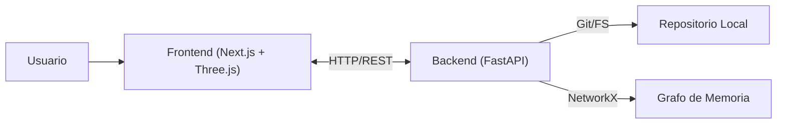

# CÓDIGO GPS 🌐

[](https://github.com/MerariJafet/codigo-gps/actions/workflows/ci.yml)

> **Navega tu código como un holograma.** Visualización 3D interactiva de bases de código complejas.


## 📸 Screenshots

| Dashboard | Holograma |
|-----------|-----------|
|  |  |

## 🚀 ¿Qué es CÓDIGO GPS?

Entender bases de código grandes es difícil. Navegar por archivos planos y carpetas anidadas no revela la estructura real del software.

**CÓDIGO GPS** transforma repositorios de Git en **grafos 3D interactivos**, permitiendo a desarrolladores y arquitectos visualizar dependencias, complejidad y la topología real de sus sistemas en tiempo real.

## ✨ Features

- **Holograma 3D Interactivo**: Visualiza nodos (archivos) y aristas (dependencias) en un entorno 3D inmersivo.
- **Nebulosas**: Agrupación visual de carpetas y módulos para identificar dominios rápidamente.
- **Modo Mentor**: Análisis inteligente que sugiere refactorizaciones y detecta "code smells" visualmente.
- **Análisis de Impacto**: Selecciona un nodo para ver qué partes del sistema dependen de él.
- **Soporte Local**: Analiza tu código sin subirlo a la nube (Privacidad 100%).

## 🏗️ Arquitectura

El sistema utiliza una arquitectura cliente-servidor moderna:



- **Frontend**: Next.js 14, React Three Fiber (Visualización 3D), TailwindCSS.
- **Backend**: Python FastAPI, NetworkX (Análisis de grafos), GitPython.

## 🛠️ Cómo correr el proyecto

### Opción A: Docker (Recomendada) 🐳

Prerrequisitos: Docker y Docker Compose instalados.

1.  Clonar el repositorio:
    ```bash
    git clone https://github.com/tu-usuario/codigo-gps.git
    cd codigo-gps
    ```

2.  Levantar servicios:
    ```bash
    docker-compose up --build
    ```

3.  Abrir en el navegador:
    - Frontend: [http://localhost:3000](http://localhost:3000)
    - API Documentación: [http://localhost:8000/docs](http://localhost:8000/docs)

### Opción B: Ejecución Local 💻

Prerrequisitos: Python 3.10+, Node.js 18+.

1.  Usar el script de arranque automático (Linux/Mac):
    ```bash
    ./scripts/dev.sh
    ```

2.  O ejecutar manualmente:

    **Backend:**
    ```bash
    cd backend
    python -m venv venv
    source venv/bin/activate
    pip install -r requirements.txt
    uvicorn backend.main:app --reload --port 8000
    ```

    **Frontend:**
    ```bash
    # En otra terminal
    cd frontend
    npm install
    npm run dev
    ```

## ⚙️ Configuración

El proyecto funciona *out-of-the-box*, pero puedes configurar variables de entorno.
Copiar `.env.example` (si existe) o configurar manualmente:

**Frontend (.env.local):**
`API_BASE_URL`: URL del backend (default: `http://localhost:8000`)

## 📖 Uso

1.  **Cargar Repositorio**: Al abrir la app, selecciona la carpeta de tu proyecto local.
2.  **Explorar Grafo**:
    - **Click Izquierdo**: Rotar cámara.
    - **Click Derecho**: Pan.
    - **Scroll**: Zoom.
    - **Click en Nodo**: Ver detalles del archivo y conexiones.
3.  **Filtrar**: Usa el panel lateral para filtrar por tipo de archivo o métricas.

## 🔧 Troubleshooting

-   **Error de CORS**: Asegúrate de acceder vía `localhost:3000`. Si el backend está en otro puerto, ajusta `next.config.ts`.
-   **File System Access**: Chrome/Edge requieren permisos explícitos para leer carpetas locales. Si falla, usa la opción de "Subir ZIP" o el explorador de servidor.
-   **Backend Offline**: Verifica `http://localhost:8000/health`.

## ⚡ Rendimiento & Límites

CÓDIGO GPS está diseñado para manejar bases de código de tamaño pequeño a mediano con alta fluidez (>60 FPS).
Consulta [BENCHMARKS.md](docs/BENCHMARKS.md) para ver métricas detalladas y metodologías de prueba.

## 🗺️ Roadmap

- [ ] Soporte para más lenguajes (Java, C++).
- [ ] Integración con GitHub API para repos remotos.
- [ ] Colaboración en tiempo real (Multi-user holograms).
- [ ] Versión Desktop (Electron/Tauri) - *En progreso*.

## 🤝 Contribución

¡Las PRs son bienvenidas! Por favor abre un issue antes de cambios grandes.

## 📄 Licencia

Este proyecto está bajo la licencia MIT. Ver [LICENSE](LICENSE) para más detalles.
