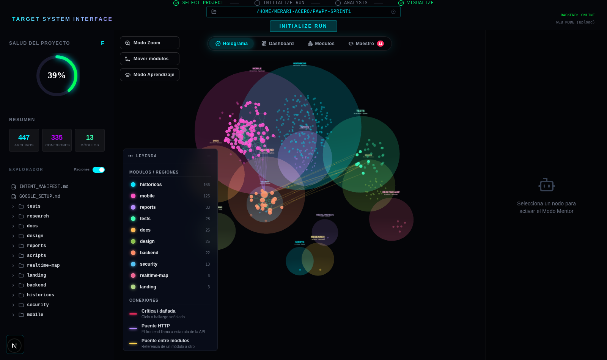
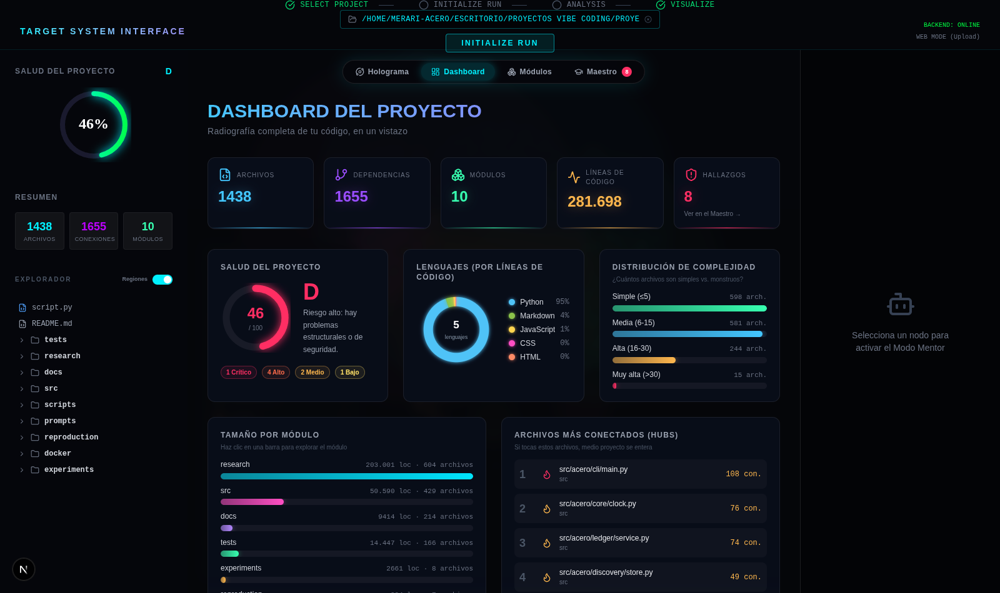
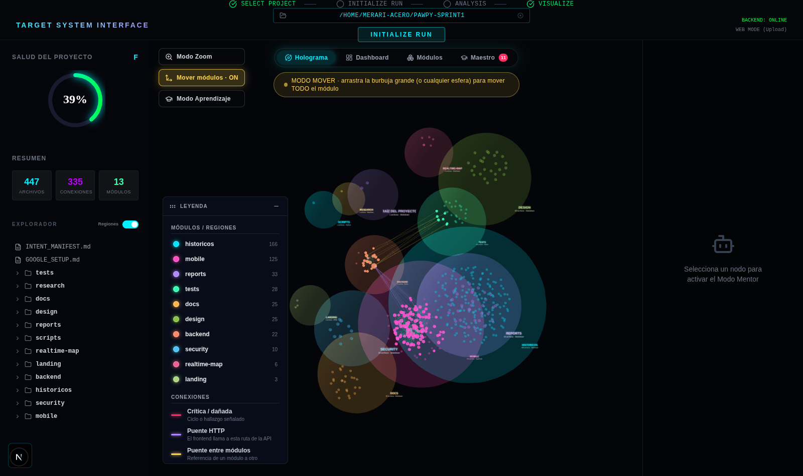
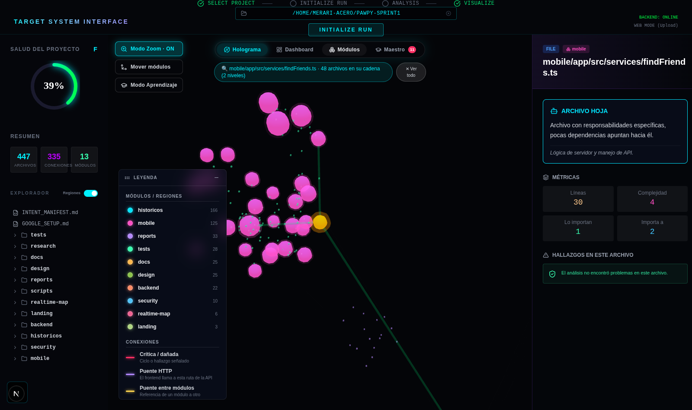
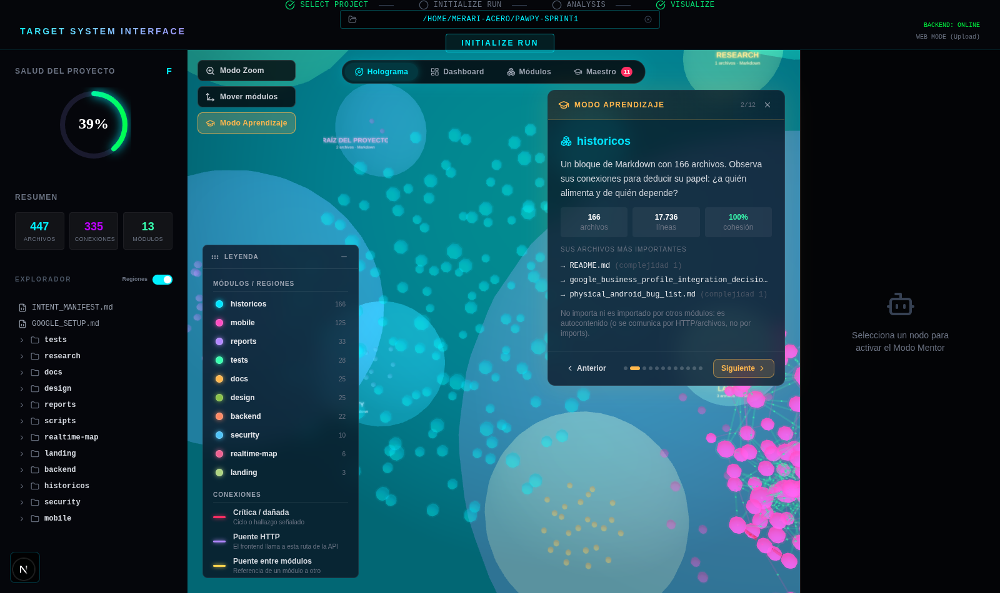
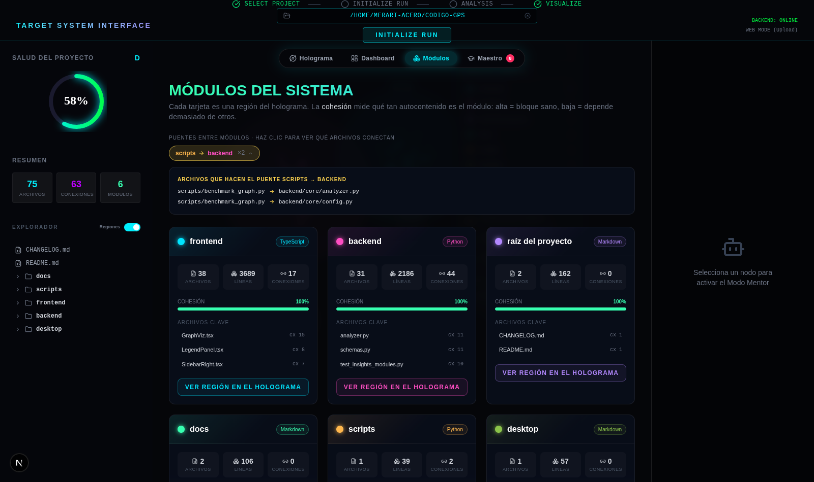
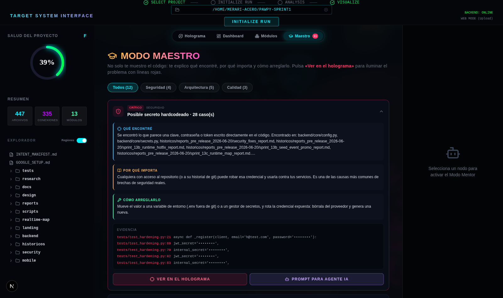
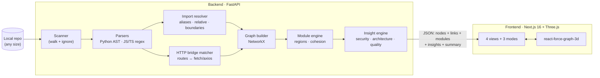

<div align="center">

# 🌐 CÓDIGO GPS

### Navigate any codebase like a hologram — and let it *teach* you

[](https://github.com/MerariJafet/codigo-gps/actions/workflows/ci.yml)
[](https://opensource.org/licenses/MIT)
[](https://www.python.org/)
[](https://nextjs.org/)
[](CONTRIBUTING.md)

**Point it at any repo → get an interactive 3D map of its modules, dependencies and problems, with a built-in mentor that explains everything in plain language.**

🇲🇽 [Leer en español](README.es.md) · 🤖 [Guide for AI agents](AGENTS.md) · 🏗️ [Architecture](docs/ARCHITECTURE.md)



</div>

---

## Why?

File trees lie. A codebase's *real* structure is who-imports-whom, which modules are tangled together, where the hidden god-files live, and which line of code is quietly holding a hardcoded secret. CÓDIGO GPS renders all of that as an explorable 3D hologram — **and then explains it to you like a senior engineer would**.

## ✨ What it does

| | Feature | Description |
|---|---------|-------------|
| 🫧 | **Module regions** | Files auto-cluster into glowing "nebulas" per logical module, with 3D labels. See the blocks of your system at a glance. |
| 🎨 | **Connection taxonomy** | Every dependency line is color-coded by meaning (see [reading the map](#-reading-the-map)). |
| 🔮 | **HTTP bridges** | Detects FastAPI routes and matches them against `fetch`/`axios` calls — so frontend↔backend links show up even without imports. |
| 🛡️ | **Analyst engine** | Static analysis for circular dependencies, god files, orphans, giant files, tangled modules, hardcoded secrets, `eval`/`exec`, SQL injection patterns, `shell=True`, insecure pickle/yaml, weak hashes, XSS sinks, open CORS and more. |
| 🎓 | **Mentor mode** | Every finding comes with *what I found / why it matters / how to fix it* — teaching, not just flagging. |
| 🤖 | **AI-agent ready** | One click copies a complete, self-contained prompt so Claude Code (or any coding agent) can verify, fix and test the finding autonomously. |
| 📊 | **Dashboard** | Health score (A–F), language donut, complexity distribution, LOC per module, most-connected hubs. |
| 🔍 | **Zoom mode** | Click a file → everything else disappears except its connection chain (2 levels deep). |
| ✋ | **Move mode** | Grab a whole module (its nebula) and drag it to declutter the map. |
| 🚶 | **Learning tour** | Guided step-by-step walkthrough: the camera flies to each module while cards explain what it is and which files matter. |
| 🐘 | **No size limits** | Analysis runs server-side against your local disk — a 36 GB / 14,500-file repo maps in ~9 seconds. |

## 🚀 Quick start

**Requirements:** Python 3.12+, Node 20+.

```bash
git clone https://github.com/MerariJafet/codigo-gps.git
cd codigo-gps
./scripts/start.sh        # installs everything and starts both services
```

Open **http://localhost:3000**, pick a project folder with the file browser (or type its path), hit **INITIALIZE RUN** — done.

<details>
<summary><b>Manual setup</b></summary>

```bash
# Backend (FastAPI on :8000)
python3 -m venv .venv
.venv/bin/pip install -r backend/requirements.txt
.venv/bin/python -m uvicorn backend.server.main:app --port 8000

# Frontend (Next.js on :3000) — in another terminal
cd frontend
npm install
npm run dev
```
</details>

<details>
<summary><b>Docker</b></summary>

```bash
docker-compose up --build
# frontend: http://localhost:3000 · backend: http://localhost:8001
```
Note: with Docker, the backend can only browse paths mounted into the container (the repo itself is mounted at `/project`). To analyze any other local folder, use the **«Subir del navegador»** button in the file picker — it reads the folder in your browser (filtered: no `node_modules`, code files only, capped) and sends it as a manifest.
</details>

## 🗺️ The four views

| View | What you get |
|------|--------------|
| **Holograma** | The 3D force-graph: files as spheres, dependencies as lines, modules as colored regions. Orbit, zoom, hover any line to see *which file connects to which* and why. |
| **Dashboard** | The project's x-ray: health gauge, severity chips, languages, complexity buckets, size per module, top hubs — everything clickable. |
| **Módulos** | One card per module (cohesion %, key files, language) plus a **bridge inspector**: click any `A → B` chip to list the exact file-to-file connections crossing that boundary. |
| **Maestro** | All findings, filterable by category, each expandable into its three teaching blocks — with **Ver en el holograma** (lights the problem up in red) and **Prompt para agente IA** (copies an agent-ready fix prompt). |



## 🎨 Reading the map

**Nodes** — one sphere per file. Size grows with connections; entrypoints glow white; hubs glow yellow; orphans are dimmed.

**Lines** — color tells you what kind of dependency you're looking at:

| Color | Meaning |
|-------|---------|
| 🔴 Red | **Critical / damaged** — circular dependency, tangled modules, or the finding you highlighted |
| 🟣 Violet | **HTTP bridge** — frontend code calling a backend API route |
| 🟡 Amber | **Module bridge** — a reference crossing module boundaries |
| 🟢 Green | **Essential** — feeds a hub file that many others depend on |
| 🎨 Module color | **Internal** — a normal import inside its own module |

Hover any line for a tooltip: `source → target · category`. The legend panel is draggable and collapsible.

## 🎮 Modes in action

| ✋ **Move mode** — grab a whole nebula and rearrange the map | 🔍 **Zoom mode** — isolate a file + its 2-level chain |
|---|---|
|  |  |

| 🚶 **Learning tour** — the camera flies module by module | 🧩 **Bridge inspector** — exact file-to-file crossings |
|---|---|
|  |  |

## 🎓 The Mentor

Findings are not just flags — each one teaches. Note the evidence below: detected **secrets are redacted** (`••••••••`) before they ever leave the analyzer, so they never reach the API, saved graphs, your screen or copied prompts.



## 🤖 For AI agents

CÓDIGO GPS is built to hand work off to coding agents:

- Every finding in **Maestro** has a *Prompt para agente IA* button → copies a self-contained prompt (finding + evidence with `file:line` + affected files + verify-and-report instructions). Paste it into Claude Code, Cursor, or any agent.
- The repo ships an [`AGENTS.md`](AGENTS.md) with the full machine-oriented map: architecture, commands, endpoints, conventions and known gotchas.

## 🏗️ How it works



The analysis pipeline in one pass:

1. **Scan** the target folder (respecting ignore lists — `node_modules`, caches, etc.).
2. **Parse** every file: imports, classes, functions, LOC, complexity — plus a security scan of the content.
3. **Resolve** imports into file→file edges (TS path aliases like `@/`, Python relative imports, path-boundary matching).
4. **Match HTTP bridges**: FastAPI route decorators ↔ frontend URL literals.
5. **Detect modules** and compute per-module cohesion/coupling.
6. **Run insights**: graph-level detectors (cycles, god files…) merged with content findings, each enriched with teaching text.
7. **Score health** (A–F with diminishing penalties) and ship everything as one JSON graph.

## 🔌 API

| Method | Endpoint | Description |
|--------|----------|-------------|
| `POST` | `/api/v1/analyze` | Analyze `{repo_path}` (or a `file_manifest`) → full graph JSON |
| `GET` | `/api/v1/system/ls?path=` | Server-side directory listing (powers the file browser) |
| `GET` | `/api/v1/graphs/{id}` | Retrieve a stored analysis |
| `GET` | `/health` | Liveness check |

The graph response contains `nodes`, `links` (with `flags`), `modules`, `module_links`, `insights` and `summary` — see [AGENTS.md](AGENTS.md#graph-response-shape) for the full shape.

## 🧪 Development

```bash
# Backend tests
.venv/bin/python -m pytest backend/tests -q

# Frontend checks
cd frontend && npx tsc --noEmit && npm run lint && npm run build
```

CI runs both suites on every PR.

## 🗺️ Roadmap

- [ ] More languages: Go, Rust, Java, C#
- [ ] Git-history layer: hotspots by change frequency
- [ ] Desktop packaging (Tauri) with native folder picker
- [ ] Export the hologram as shareable interactive HTML
- [ ] Deeper agent integration: run the fix loop from inside the app

## 🤝 Contributing

Issues and PRs welcome. Keep PRs focused, add tests for backend changes, and make sure `pytest` + `npm run lint` + `npm run build` pass.

## 📄 License

[MIT](LICENSE) — do whatever you want, just keep the notice.

---

<div align="center">
<sub>Built with FastAPI · NetworkX · Next.js · Three.js · react-force-graph — and a lot of neon.</sub>
</div>
