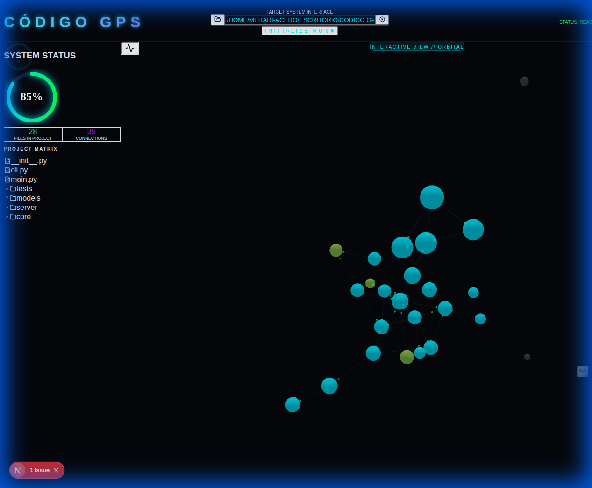
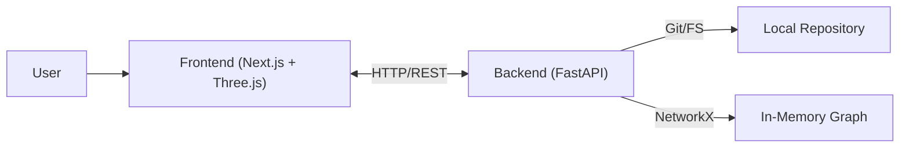

# CÓDIGO GPS 🌐

[](https://github.com/MerariJafet/codigo-gps/actions/workflows/ci.yml)
[](https://opensource.org/licenses/MIT)
[](https://github.com/MerariJafet/codigo-gps/releases)

> **Navigate your code like a hologram.** Interactive 3D visualization of complex codebases.


## 📸 Screenshots

| Dashboard | Hologram |
|-----------|-----------|
|  |  |

## 🚀 What is CÓDIGO GPS?

Understanding large codebases is hard. Navigating flat files and nested folders doesn't reveal the true structure of software.

**CÓDIGO GPS** transforms Git repositories into **interactive 3D graphs**, allowing developers and architects to visualize dependencies, complexity, and the real topology of their systems in real-time.

## ✨ Features

- **Interactive 3D Hologram**: Visualize nodes (files) and edges (dependencies) in an immersive 3D environment.
- **Nebulas**: Visual grouping of folders and modules to identify domains at a glance.
- **Mentor Mode**: Intelligent analysis suggesting refactors and detecting code smells visually.
- **Impact Analysis**: Select a node to see which parts of the system depend on it.
- **Local Support**: Analyze your code without uploading to the cloud (100% Privacy).

## 🏗️ Architecture

The system uses a modern client-server architecture. See [ARCHITECTURE.md](docs/ARCHITECTURE.md) for details.



- **Frontend**: Next.js 14, React Three Fiber (3D Visualization), TailwindCSS.
- **Backend**: Python FastAPI, NetworkX (Graph Analysis), GitPython.

## 🛠️ Getting Started

### Option A: Docker (Recommended) 🐳

Prerequisites: Docker and Docker Compose installed.

1.  Clone the repository:
    ```bash
    git clone https://github.com/MerariJafet/codigo-gps.git
    cd codigo-gps
    ```

2.  Spin up services:
    ```bash
    docker-compose up --build
    ```

3.  Open in your browser:
    - Frontend: [http://localhost:3000](http://localhost:3000)
    - API Docs: [http://localhost:8000/docs](http://localhost:8000/docs)

### Option B: Local Execution 💻

Prerequisites: Python 3.10+, Node.js 18+.

1.  Use the automatic start script (Linux/Mac):
    ```bash
    ./scripts/dev.sh
    ```

2.  Or run manually:

    **Backend:**
    ```bash
    cd backend
    python -m venv venv
    source venv/bin/activate
    pip install -r requirements.txt
    uvicorn backend.main:app --reload --port 8000
    ```

    **Frontend:**
    ```bash
    # In another terminal
    cd frontend
    npm install
    npm run dev
    ```

## ⚙️ Configuration

The project works out-of-the-box, but you can configure environment variables.
Copy `.env.example` or configure manually:

**Frontend (.env.local):**
`API_BASE_URL`: Backend URL (default: `http://localhost:8000`)

## 📖 Usage

1.  **Load Repository**: Open the app and select your local project folder.
2.  **Explore Graph**:
    - **Left Click**: Rotate camera.
    - **Right Click**: Pan.
    - **Scroll**: Zoom.
    - **Click on Node**: View file details and connections.
3.  **Filter**: Use the sidebar to filter by file type or metrics.

## 🔧 Troubleshooting

-   **CORS Error**: Ensure you access via `localhost:3000`. If backend is on another port, adjust `next.config.ts`.
-   **File System Access**: Chrome/Edge require explicit permissions for local folders. If it fails, use "Upload ZIP" or the server explorer.
-   **Backend Offline**: Verify `http://localhost:8000/health`.

## ⚡ Performance & Limits

CÓDIGO GPS is designed to handle small to medium codebases with high fluidity (>60 FPS).
Check [BENCHMARKS.md](docs/BENCHMARKS.md) for detailed metrics and testing methodology.

## 🗺️ Roadmap

- [ ] Support for more languages (Java, C++).
- [ ] GitHub API integration for remote repos.
- [ ] Real-time collaboration.
- [ ] Desktop version (Electron/Tauri) - *In progress*.

## 📄 License

This project is licensed under the MIT License. See [LICENSE](LICENSE) for details.
