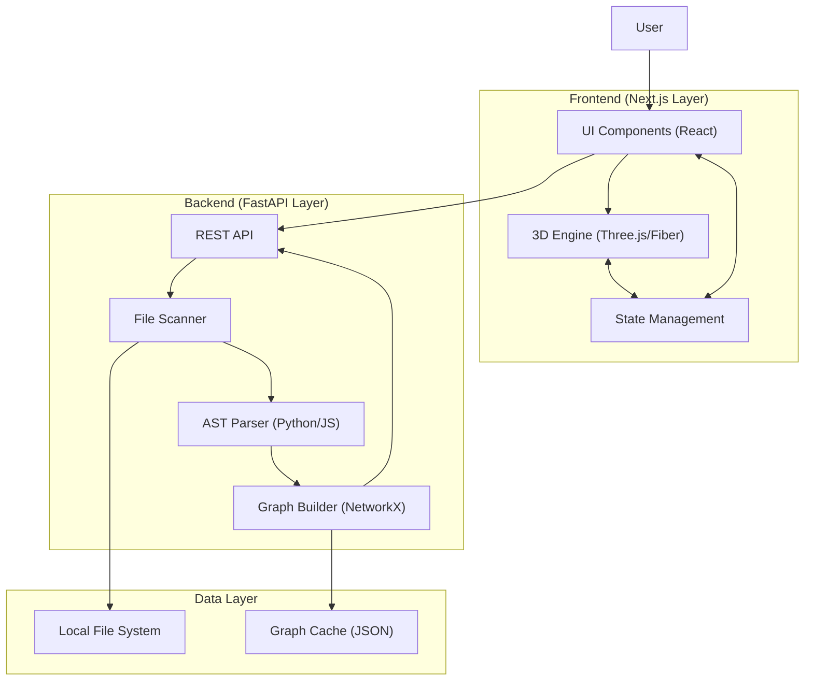

# Architecture & Design 🏗️

This document describes the high-level architecture of **CÓDIGO GPS** and how its components interact.

## High-Level Overview

CÓDIGO GPS follows a **Client-Server** model where the heavy lifting of code analysis is done by a Python backend, and the interactive visualization is handled by a Next.js frontend using WebGL (Three.js).

## Component Breakdowns

### 1. Backend (Python/FastAPI)
- **Scanner**: Recursively crawls the target directory, respecting `.gitignore` and configured extensions.
- **Parser**: Uses the `ast` module for Python and regex-based heuristics for JavaScript/TypeScript to extract imports and module structure.
- **Graph Builder**: Utilizes `NetworkX` to construct a directed graph where nodes are files and edges are dependencies. It also calculates metrics like *Betweenness Centrality* to determine node importance.

### 2. Frontend (Next.js/Three.js)
- **3D Visualization**: Uses `react-force-graph-3d` (powered by Three.js) to render the dependency graph in a 3D space.
- **Performance Engine**: Implements Level of Detail (LOD) and optimized rendering loops to maintain 60FPS on medium-sized codebases.
- **Cyberpunk UI**: A custom CSS/Tailwind theme designed for a futuristic "holographic" aesthetic.

## Data Flow
1. User provides a local path.
2. Backend scans and parses files, returning a JSON representation of the graph.
3. Frontend receives the graph and initializes the 3D physics simulation.
4. User interacts with nodes to see specific file metrics and dependency chains.
5. (Optional) Mentor mode analyzes the graph structure to suggest architectural improvements.
