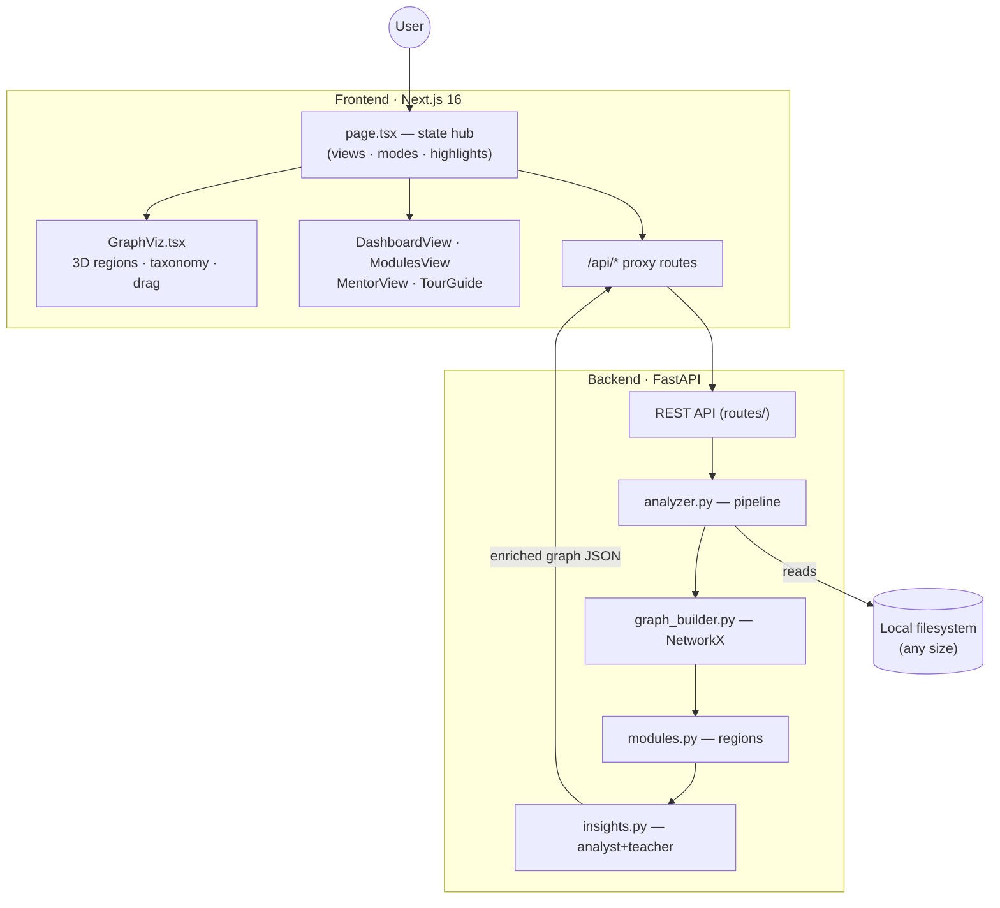
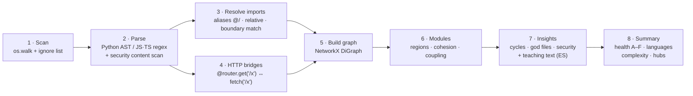

# Architecture & Design 🏗️

How **CÓDIGO GPS** turns a folder on disk into an explorable, teaching 3D map.

## High-level overview

Client–server: a Python backend does the heavy analysis; a Next.js frontend renders the result with WebGL (Three.js via `react-force-graph-3d`).

## The analysis pipeline (`backend/core/analyzer.py`)

1. **Scan** — walks the target directory honoring `AnalysisOptions.ignore_patterns` (`node_modules`, caches, venvs…).
2. **Parse** — Python via `ast`; JS/TS via regex heuristics. Each file yields imports, classes, functions, LOC, complexity, plus `scan_content` security findings and (for Python) route declarations / (for JS) URL literals.
3. **Resolve** — imports become file→file edges. Handles TS path aliases (`@/`, `~/`), Python relative imports (dot levels), and matches only on path-segment boundaries to avoid false positives.
4. **HTTP bridges** — normalized FastAPI route paths matched against normalized frontend URL literals produce `api_call` edges (flag `api`). Excluded from cycle detection.
5. **Graph build** — NetworkX computes degrees; nodes get layer/role classification.
6. **Modules** (`modules.py`) — grouping by top-level folder (splitting dominant folders one level deeper), then per-module stats: LOC, avg complexity, internal/external links, cohesion, main language, top files. Also aggregated `module_links`.
7. **Insights** (`insights.py`) — two stages merged: content rules (regex over file contents, with exclusions to reduce false positives) and graph detectors (simple cycles capped and guarded on dense graphs, god files, orphans, giant files, bidirectional module tangles). Findings above a count threshold are **aggregated** into single insights. Every insight carries `explanation`, `why_matters`, `recommendation` and `evidence[{file,line,snippet}]`.
8. **Summary** — health score with diminishing penalties (first 3 findings per severity weigh full, the rest √), grade A–F, language/complexity distributions, top hubs.

## Frontend anatomy (`frontend/src/`)

- **`app/page.tsx`** — owns all cross-view state: active view (Holograma / Dashboard / Módulos / Maestro), zoom & move modes, learning tour, insight highlighting, module focus, selected node.
- **`components/GraphViz.tsx`** — the 3D scene:
  - *Regions*: module centers on a golden-spiral sphere; nodes seeded near their center; custom cluster force (alpha-proportional) + weakened cross-module link force + disabled `center` force keep regions coherent. Nebulas + label sprites are THREE objects rebuilt on state changes and moved imperatively during drags.
  - *Link taxonomy*: category → color/width/particles; hover tooltip via `linkLabel`.
  - *Zoom mode*: BFS (depth 2) over an adjacency map; `nodeVisibility`/`linkVisibility` hide the rest.
  - *Move mode*: node drags translate the whole module (siblings pinned via `fx/fy/fz`); nebula drags use a capture-phase raycast with OrbitControls disabled; offsets persist per analysis and physics re-settles on release.
- **Views** are overlay panels above the always-mounted canvas; **charts** are dependency-free SVG.
- **`app/api/*`** — Next server routes proxying the backend, so the browser only ever talks to `:3000`.

## Security posture

- Path traversal guarded (`validate_repo_path` confines to the user home).
- Zip extraction guarded against Zip-Slip.
- Bearer-token auth with localhost-permissive dev mode; rate limiting (10 req/min/IP) and an analysis concurrency semaphore.
- The analyzer only ever *reads* target repositories.

## Performance notes

- 36 GB repo (14,580 files on disk, 1,438 code files after filtering): ~9 s analysis, 1,655 links, 10 modules.
- Cycle enumeration skipped above 5,000 links (guard against combinatorial blowup).
- Frontend performance modes (quality / balanced / high-performance) adjust geometry detail, particles and physics.
